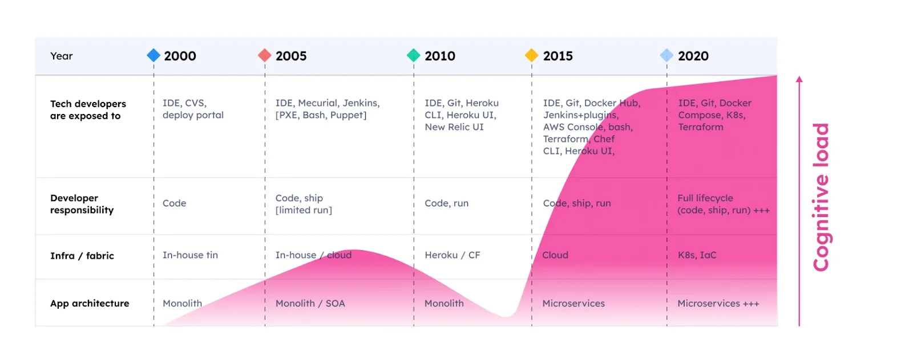
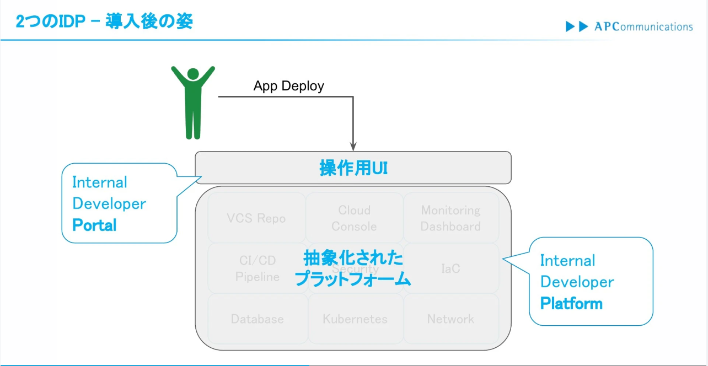
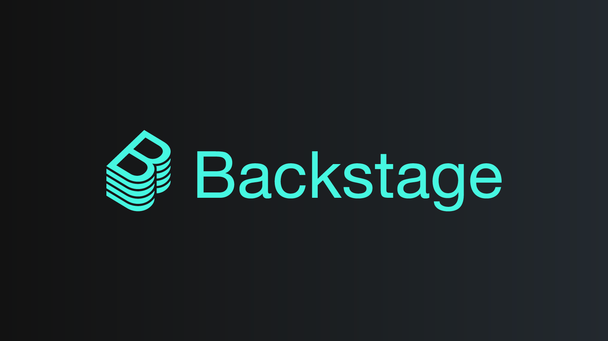

# First step of Platform  Engineering
<!-- TOC -->

- [First step of Platform  Engineering](#first-step-of-platform--engineering)
  - [Hype Cycles from Gartner](#hype-cycles-from-gartner)
    - [先進テクノロジーのハイプサイクル:2023年](#先進テクノロジーのハイプサイクル2023年)
    - [ソフトウェアエンジニアリングのハイプサイクル:2023年](#ソフトウェアエンジニアリングのハイプサイクル2023年)
  - [Cloud Native \& DevOps](#cloud-native--devops)
    - [Cloud Native](#cloud-native)
    - [DevOps](#devops)
    - [効率的なDevOpsの実現 =\> Platform Engineeringの登場](#効率的なdevopsの実現--platform-engineeringの登場)
  - [What is Platform Engineering?](#what-is-platform-engineering)
    - [From Gartner](#from-gartner)
    - [From platformengineering.org](#from-platformengineeringorg)
  - [まとめてみると](#まとめてみると)
  - [雑にかみ砕くと (※個人の解釈)](#雑にかみ砕くと-個人の解釈)
  - [開発者向けセルフサービス型の共通基盤がなぜ必要か？](#開発者向けセルフサービス型の共通基盤がなぜ必要か)
    - [クラウド＆DevOpsの登場](#クラウドdevopsの登場)
    - [そのうえで...](#そのうえで)
    - [クラウドの登場 =\> Devopsの推進 =\> 認知負荷の増大化](#クラウドの登場--devopsの推進--認知負荷の増大化)
    - [認知負荷とは](#認知負荷とは)
    - [3種の認知負荷](#3種の認知負荷)
  - [Platform Engineeringの目的](#platform-engineeringの目的)
  - [Internal Developer PortalとInternal Developer Platform](#internal-developer-portalとinternal-developer-platform)
    - [Internal Developer Platform](#internal-developer-platform)
    - [Internal Developer Portal](#internal-developer-portal)
    - [Internal Developer Portalの代表例: Backstage](#internal-developer-portalの代表例-backstage)
  - [Wikiから始めるPlatform](#wikiから始めるplatform)
      - [MBS部のwiki...](#mbs部のwiki)
    - [MBS部のBacklogがあるじゃあないか！！！](#mbs部のbacklogがあるじゃあないか)
  - [まとめ](#まとめ)

<!-- /TOC -->

## Hype Cycles from Gartner

### 先進テクノロジーのハイプサイクル:2023年

現在ピーク期かつ5-10年以内にはクラウドネイティブがモダンな開発手法となっている


### ソフトウェアエンジニアリングのハイプサイクル:2023年

プラットフォーム エンジニアリングが2-5年以内に定常的に採用されることが予想されている


---

## Cloud Native & DevOps

### Cloud Native

クラウドの**小さくはじめて・素早く・柔軟に**デプロイできる利点を活用したシステムの設計/構成

### DevOps

ソフトウェアの**開発と運用を柔軟で迅速に実施し、かつイテレーティブにアップデートしていく**ようなアプローチ

```
- 自動化
- 継続的インテグレーション(CI)
- 継続的デリバリー(CD)
- 計測とフィードバック
```

### 効率的なDevOpsの実現 => Platform Engineeringの登場

## What is Platform Engineering?

### From Gartner

**本文**

> Platform engineering improves developer experience and productivity by providing self-service capabilities with automated infrastructure operations. It is trending because of its promise to optimize the developer experience and accelerate product teams’ delivery of customer value.

**日本語訳**

> プラットフォーム エンジニアリングは、自動化されたインフラストラクチャ運用による**セルフサービス機能を提供**することで、開発者のエクスペリエンスと生産性を向上させます。開発者のエクスペリエンスを最適化し、プロダクトチームによる顧客価値の提供を加速することが約束されているため、トレンドになっています。

### From platformengineering.org

**本文**

> Platform engineering is the discipline of designing and building toolchains and workflows that enable self-service capabilities for software engineering organizations in the cloud-native era. Platform engineers provide an integrated product most often referred to as an “Internal Developer Platform” covering the operational necessities of the entire lifecycle of an application.

**日本語訳**

> プラットフォーム エンジニアリングは、**クラウドネイティブ時代のソフトウェア エンジニアリング組織のセルフサービス機能を可能にするツールチェーンとワークフローを設計および構築する**分野です。プラットフォーム エンジニアは、アプリケーションのライフサイクル全体の運用上の必要性をカバーする、「内部開発者プラットフォーム」と呼ばれる統合製品を提供します。

## まとめてみると

【開発者向けのセルフサービス型の共通基盤をプロダクトとして運用すること】

## 雑にかみ砕くと (※個人の解釈)

【**開発者向けの情シス的支援を目的とした**共通基盤をプロダクトとして運用していく取り組み】

> こう解釈すると、[MBS部の2024年の運用方針](https://docs.google.com/presentation/d/1jB8pt-dCZDgWMiYYXYfb3PMmLsgLjJa4_Cqrm1l0-Q8/edit#slide=id.g263ff1a3fc9_0_1408)の情シスDXにも結びつきますね。

---

## 開発者向けセルフサービス型の共通基盤がなぜ必要か？

### クラウド＆DevOpsの登場

もういちど[Cloud Native & DevOps](#cloud-native--devops)を参照してみてください

### そのうえで...

「時代はクラウドネイティブだ！」と言っても登場人物はこんなにいる


### クラウドの登場 => Devopsの推進 => 認知負荷の増大化



---

### 認知負荷とは

- 「人間の認知アーキテクチャの能力と限界」を出発点とした、効果的な学習デザインを考案するための理論
- 人間の頭の中で一度に処理できる情報量には限界があることを前提としている
- 3種類の負荷が存在

> 認知負荷理論についての詳細は[こちら](https://zenn.dev/kangetsu_121/articles/6b31565dda6053#fn-433b-6)を参照

### 3種の認知負荷

- 課題内在的負荷 (Intrinsic cognitive load)
    - 学習対象そのものの難易度により生じる負荷
    - 学習者の既有知識や習熟度によって増減する
- 課題外在的負荷 (Extraneous cognitive load)
    - 学習以外(指導者や教材)の難易度により生じる負荷
    - 学習に無関係であり、余計な負荷
- 学習関連負荷 (Germane cognitive load)
    - 学習目標の達成のための認知活動により生じる負荷

**いかに、課題内在的負荷と課題外在的負荷をできる限り低減させ、学習関連負荷の割合を増やして生産的な学習をするかが重要**

## Platform Engineeringの目的

開発者に降りかかる認知負荷の軽減と、生産性の向上を目指し、  
開発者を向けのセルフサービス型の基盤を提供する活動

---

## Internal Developer PortalとInternal Developer Platform

### Internal Developer Platform

アプリケーションが動作する環境を抽象化(わかりやすく)したもの  
開発者が必要とする機能や仕組みをプラットフォームチームは整備する  
**開発者が「自分で構築して実行する」真のDevOpsを効果的に実現するもの**

### Internal Developer Portal

**開発者がプラットフォームを操作するためのUI**  
開発者ポータルによってセルフサービスでの利用を実現する



> [Backstageで始める新たな開発者体験](https://www.docswell.com/s/ussvgr/Z8GY72-2023-03-09-pfem-backstage#p14)

### Internal Developer Portalの代表例: Backstage



インフラ全体を網羅することを目的にSpotify社が開発した開発者向けポータルのOSS  
2020年にCloud Native Computing Foundationに寄贈されている  
下記のような機能で構成される
- Template
    - 社内標準の構成をテンプレート化することで、開発者は効率よくサービスを作成できる
- Catalog
    - 社内のアプリケーションをカタログ化して一覧表示する
- TechDocs
    - Markdown形式のドキュメントを一元管理する
- Plug-in
    - 拡張可能なプラグインを用いて、自社にあったツールやサービスを統合できる

Backstageを使うことで、開発者は多様なインフラツールに深い知識を持つ必要がなく、インフラを抽象化することで、安全かつ迅速にシステムを構築、スケールアップすることができる

---

## Wikiから始めるPlatform

[CNCF Platforms White Paper](https://tag-app-delivery.cncf.io/whitepapers/platforms/)にて、

**本文**

> a very simple “platform” could be a wiki page with links to standard operating procedures to provision capabilities from providers

**シンプルなプラットフォームはwiki**であるとの言及がある。

#### MBS部のwiki...

### MBS部のBacklogがあるじゃあないか！！！

- まずは[knowledge_share](https://apc-mbs.backlog.com/wiki/KNOWLEDGE_SHARE/Home)に投稿してみましょう
- 投稿したら[slack](https://ap-com.slack.com/archives/C06G313V55X)で表明しましょう
- 投稿した内容は適宜アップデートしましょう
- 定期的にwikiの整理をしましょう
- 上記を促すようなコミュニケーションをしていきましょう

## まとめ

- Platform Engineeringは開発者に降りかかる認知負荷の軽減と、生産性の向上を目指し、  
開発者を向けのセルフサービス型の基盤を提供する活動
- Internal Developer Platformはアプリケーションが動作する環境を抽象化(わかりやすく)したもの
- Internal Developer Portalは開発者がプラットフォームを操作するためのUI
- Internal Developer Portalの代表例の1つがBackstage
    - Backstageの続編はとうご期待...!!