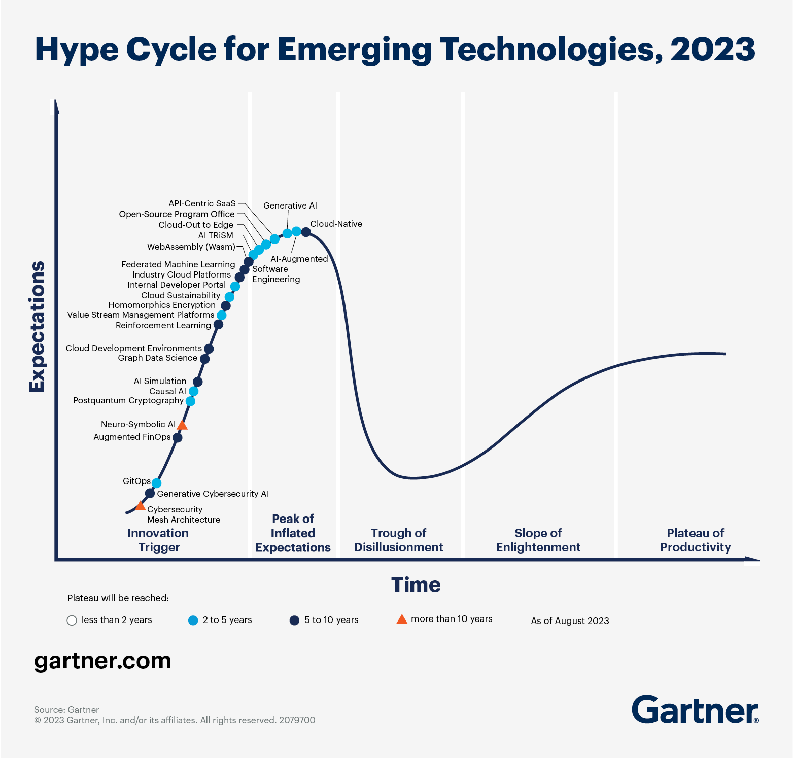

# First step of Platform  Engineering

## Hype Cycles from Gartner

**先進テクノロジーのハイプサイクル:2023年**

**ソフトウェアエンジニアリングのハイプサイクル:2023年**

---

## What is Platform Engineering?

### From Gartner

### From CNCF

## ざっくりまとめると

- 【**開発者向けのセルフサービス型の共通基盤**をプロダクトとして運用すること】

- 【開発者向けの**セルフサービス型の共通基盤をプロダクトとして運用すること**】

## 更に雑にまとめると (※個人の解釈)

- 【**開発者向けの情シス担当**として共通基盤を運用していく取り組み】

---

## ①開発者向けセルフサービス型の共通基盤がなぜ必要か？

### クラウド＆DevOpsの登場

### ちなみに...

「時代はクラウドネイティブだ！」と言っても登場人物はこんだけいる

### Devopsを推進していく -> 認知負荷の増大化

### 認知負荷とは

### 3種の認知負荷

## ①のまとめ

## ②セルフサービス型の共通基盤をプロダクトで運用していくためには？

### Platform as a Service

### Internal Developer Platform

### Internal Developer Portal

### IDPの代表例

### 共通プラットフォームのアンチパターン

### 目指すべきもの

### どうやって目指していくのか？

#### ProductとProject

#### ProductとProjectの関係性

## まとめ